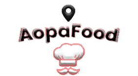
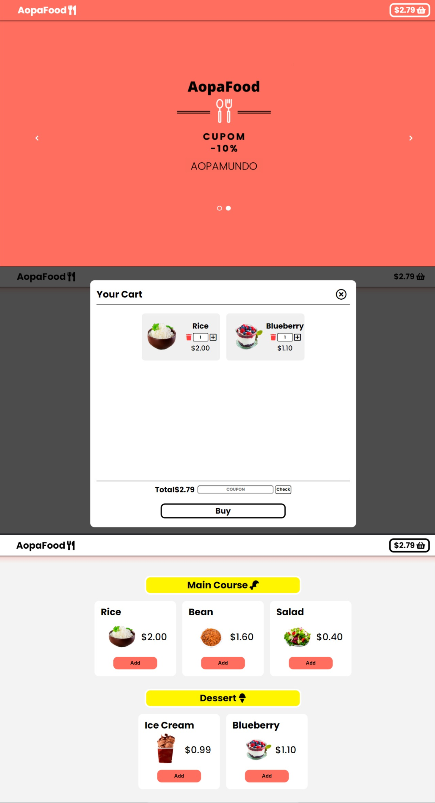
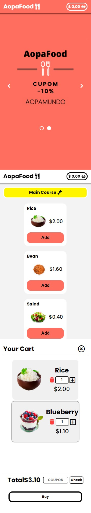

# AopaFood

  
  [Portuguese](README.md)
  

  

 
 

 
  
     
    
     
   

 <a href="#eye_speech_bubble-visualizar">Visualizar</a> •
 <a href="#hammer_and_wrench-tecnologias">Tecnologias</a> • 
 <a href="#brain-conceitos-aplicados">Conceitos</a> •
 <a href="#boy-autor">Autor</a> •
 <a href="#balance_scale-licença">Licença</a>

---

## :eye_speech_bubble: **Visualizar**

Deploy do front-end efetuado no [Netlify](https://www.netlify.com/) para visualizar: [Clique Aqui](https://ryandrop-aopafood.netlify.app/)

|                            :computer:Desktop                             |                             :iphone: Mobile                             |
| :----------------------------------------------------------------------: | :---------------------------------------------------------------------: |
| <kbd></kbd> | <kbd></kbd> |

  
---
## :information_source: _Sobre_

Minha aplicação que simula um app de delivery mais simplificado !

---

## :hammer*and_wrench: \_Tecnologias*

| :globe_with_meridians: FrontEnd |
| :-----------------------------: |

| [HTML 5](https://www.w3schools.com/html/) |
| [CSS3](https://www.w3schools.com/css/) |
| [JavaScript ES6](https://developer.mozilla.org/en-US/docs/Web/JavaScript) |

---

## :brain: _Conceitos Aplicados_

|     :page_facing_up:     |
| :----------------------: |
|       Mobile First       |
|       Media Query        |
|      Atomic Commit       |
|   Conventional Commits   |
|         Flexbox          |
| Destructuring Assignment |

---

## :boy: _Autor_

<a href="https://github.com/RyanDrop">
 
  
 <b>RyanDrop</b>
</a>

Desenvolvido com ❤️ por RyanDrop👋🏽 Meus Contatos!

---

## :balance*scale: \_Licença*

Copyright ©️ 2021 [RyanDrop ](https://github.com/RyanDrop). 
This project is licensed by [MIT](./LICENSE).

---
